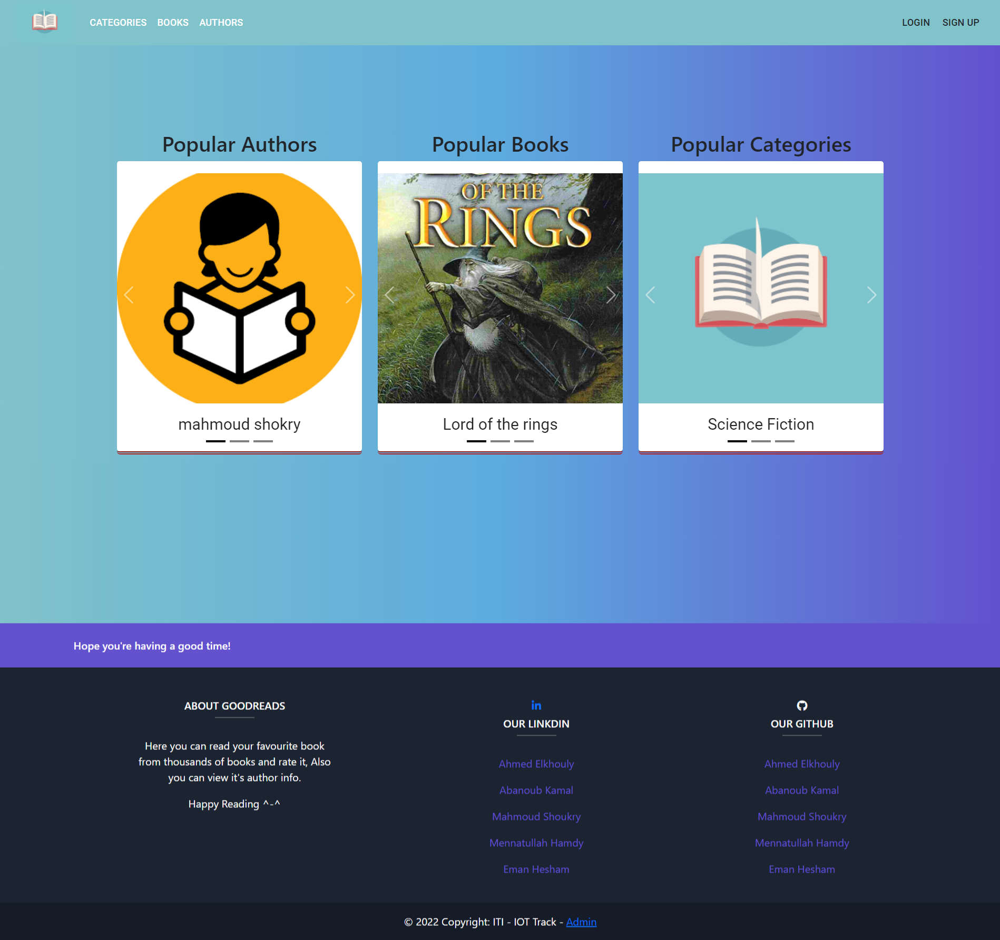
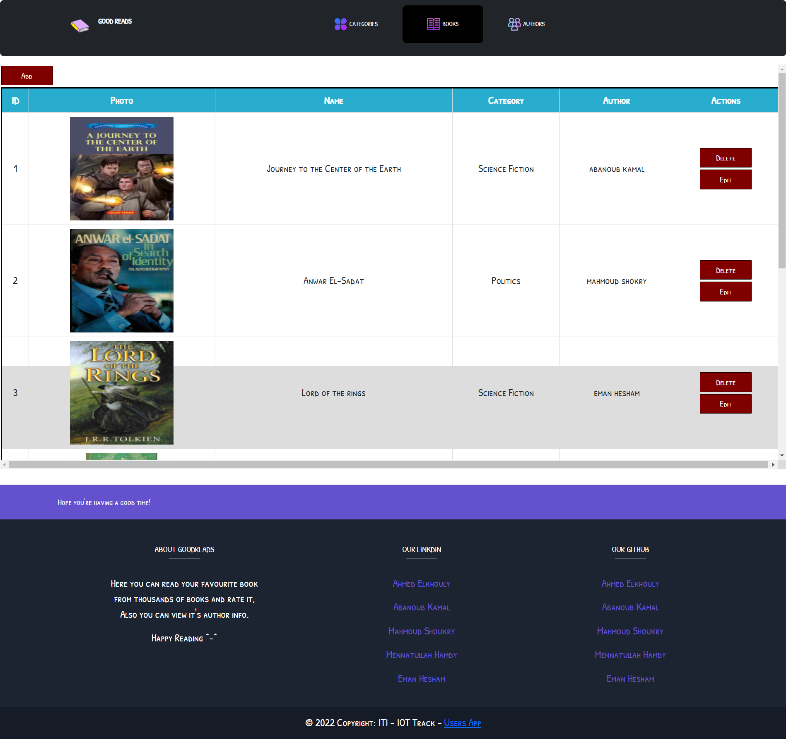

<h1 align="center">Goodreads MERN Project</h1>
<h3 align="center">ITI students, IoT departments intake 42 (2022)</h3>  
 

## OBJECTIVE
  This project aims to develop a Good Reads App using MERN stack. It mainly consists of developing and implementing two Front End Apps 
  (user and admin apps) using React JavaScript library, and Back End server using NodeJs and MongoDB.  

  
<!-- #################################################### -->
<h1 align="center">Back End App</h1>
<h2>Server App<h2>
 
 

  
    
<!-- #################################################### -->
<h1 align="center">Front End App</h1>
  <h2>User App</h2>
  <h2><a href="https://github.com/AhmedElKhouly99/Good-Reads-Users">GitHup link user-app</a></h2>
  
  

      
  

  
    
<!-- #################################################### --> 
  <h2>Admin App</h2>
  <h2><a href="https://github.com/mennahamdy33/good-reads-admin-app-frontend">GitHup link admin-app</a></h2>
  
  

  
  

  
    
## Try to use our app from this link (deployment)
<h2><a  href="https://goodreadsusers.herokuapp.com/">user-app</a></h2>
  
## Contributors
- Ahmed El khouly
- Eman Hesham
- Menna Hamdy
- Mahmoud Shokry
- Abanoub Kamal

  
## License
this project under the GNU General Public License v2.0.
